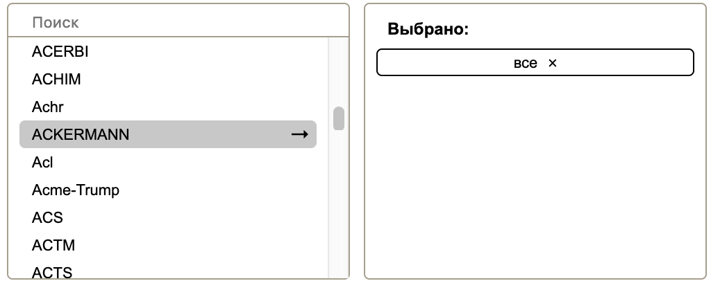

## Компонент множественного выбора параметров

Стэк: Vue, ES6

Особенности:
 - 2 режима: ajax (подгрузка данных с сервера), обычный (данные прокидываются при старте)
 - возможность задать шаблон для вывода наименования через формат Vue 

 